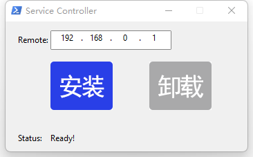

# A watcher for Remote file

## Run as a Windows service

Automatically install the service to the specified location and then automatically start.
Or you can view the running status of the service.
After uninstalling the service, the service will be completely removed on this machine, leaving nothing behind.

## Monitor the specified directory

* (Optional, including the subdirectories of the directory) and changes to its files.
* Report the name of the newly added file or directory.
* Report the name of the deleted file or directory. When deleting a directory, you can optionally report the changes in the directory or only report the name of the deleted directory.
* Report the moved files or directories in the current directory.

## Remotely receive change events

Changes to the monitoring directory can be reported to the designated host.
New files can be uploaded automatically.
